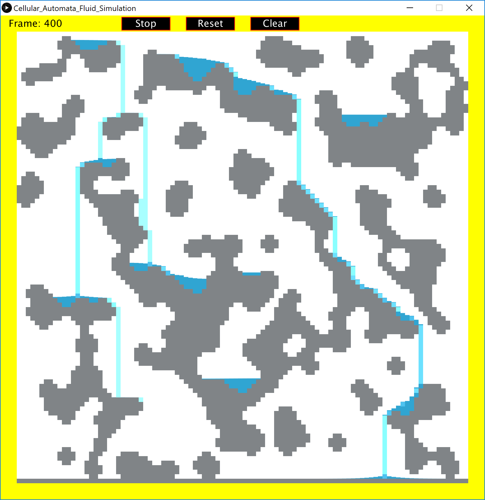
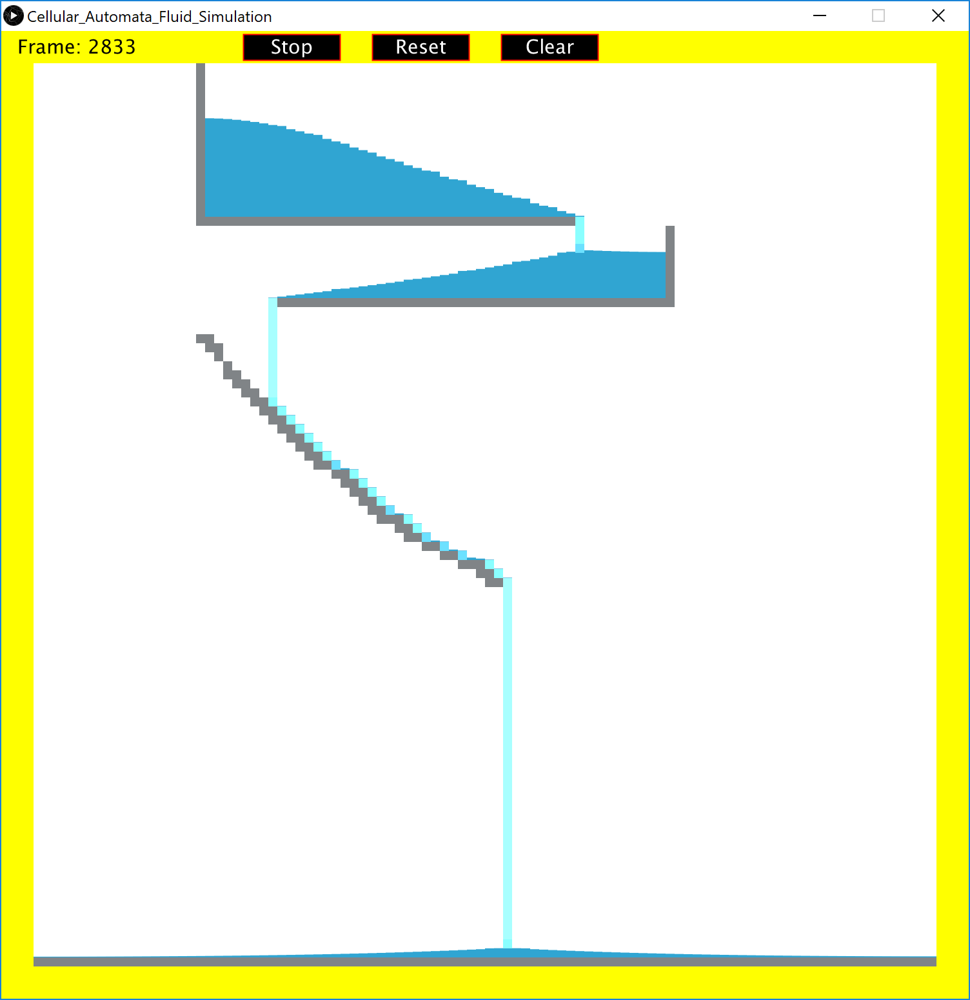

# CA-Fluid-Simulation

A two dimensional fluid simulation using [cellular automaton](https://en.wikipedia.org/wiki/Cellular_automaton). Since this is a cellular automaton simulation, the state of each cell is only dependent on its neighbouring cells. Each cell has a possible three states, wall, space, or liquid. There is the option to adjust the state of each cell, providing the ability for endless customization. 

Be aware that this simulation is very basic, so it does not take into account a variety of other fluid properties, such as pressure, density, etc.

## Requirements

* Processing (version 3 or newer)

## Installing

Simply open "Cellular_Automata_Fluid_Simulation.pde" in the "Cellular_Automata_Fluid_Simulation" folder through Processing and run.

## Instructions

When starting up the program, the terrain is automatically generated in the form of cave structures (also through cellular automaton). Near the top, there are buttons to start the simulation, reset the terrain, or clear the board. 

There are three main mouse controls that changes the state of a cell,
* Left mouse click for water
* Right mouse click for wall
* Middle mouse click for space

## Rules

To be added...

## Screenshots

## Built With

* Processing

## Author(s)

* Bob Huang
